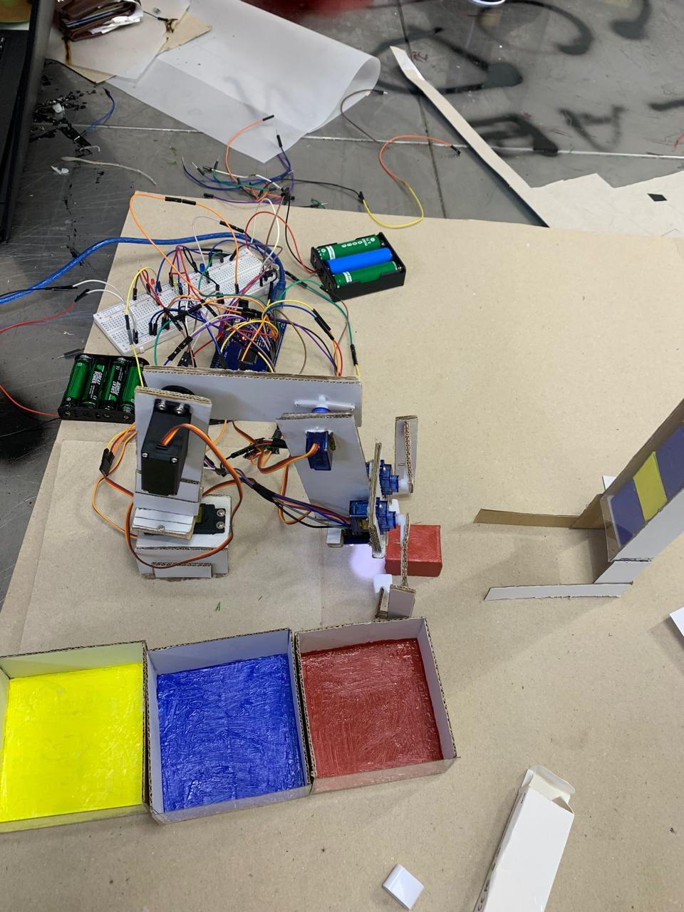
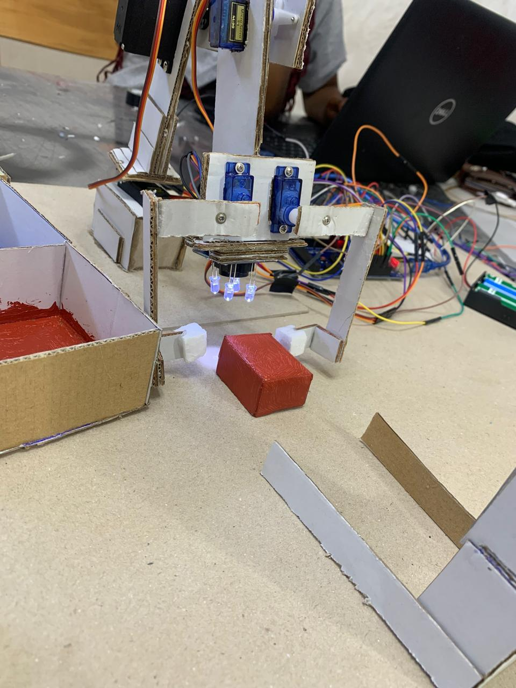
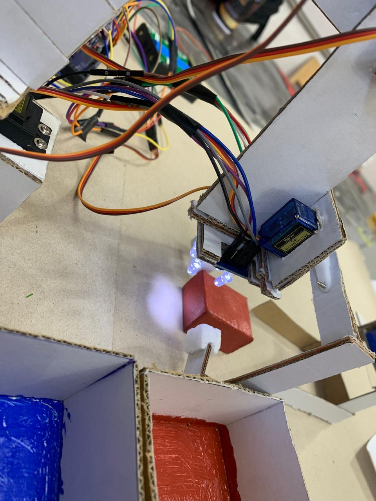
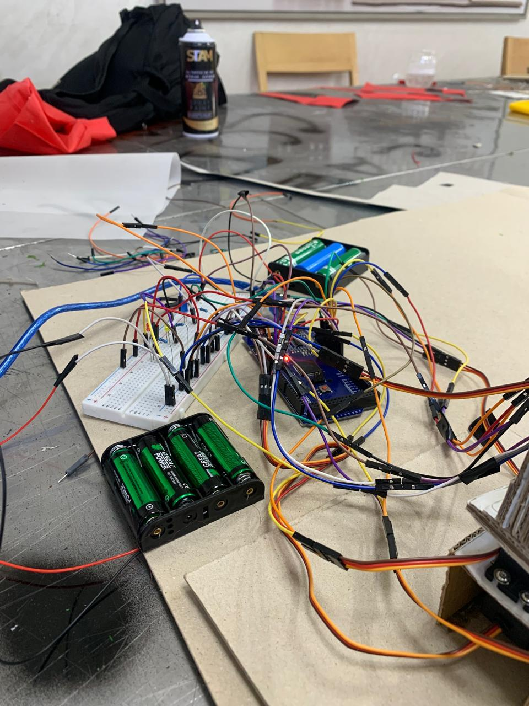
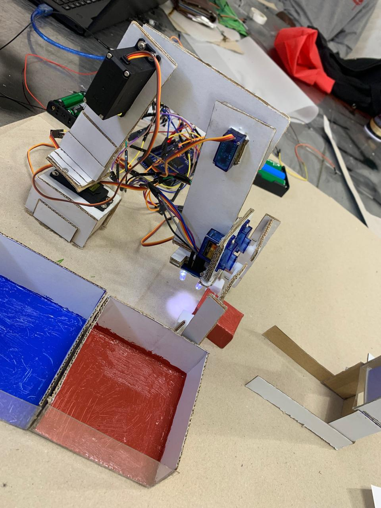
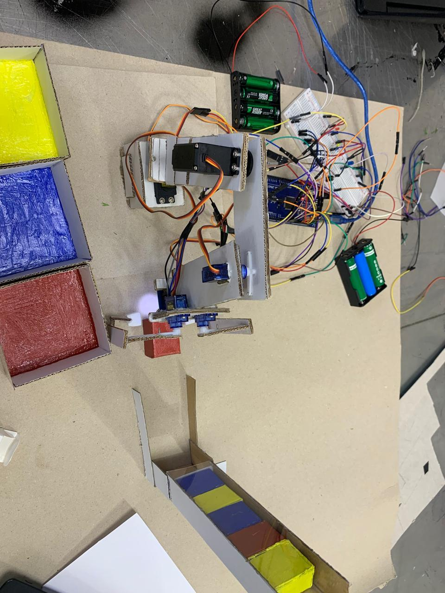

# 🦾 OBRAS - Bras Robotisé à Détection de Couleurs Automatisée

## 📌 Présentation du Projet
Réalisé dans le cadre de ma 2ème année de classes préparatoires intégrées à l'**EIDIA (Université Euro-Méditerranéenne de Fès)**, le projet **OBRAS** consiste en la conception et la programmation d'un bras robotisé intelligent. 

L'objectif est d'automatiser le tri d'objets : le système détecte la couleur d'un élément via un capteur optique, le saisit, puis le dépose dans un bac de stockage correspondant. Ce projet démontre des compétences en **électronique embarquée**, **programmation C/C++ (Arduino)** et **mécatronique**.

## 🛠️ Caractéristiques Techniques
* **Contrôleur Central** : Arduino MEGA.
* **Capteur de Vision** : TCS3200 (Module de reconnaissance de couleurs par fréquence).
* **Actionneurs** : 5 Servomoteurs pilotant les axes du bras et la pince de préhension.
* **IHM (Interface Homme-Machine)** : Système de diagnostic par LEDs (Bleu, Jaune, Rouge) pour confirmer la détection en temps réel.
* **Matériaux** : Structure conçue en plexiglas et carton (épaisseur 3mm) pour allier légèreté et robustesse.

## 📸 Galerie du Prototype
Le prototype a été entièrement conçu et assemblé manuellement, utilisant une structure hybride en carton et plexiglas pour tester les algorithmes de tri.

| Vue d'ensemble du système | Focus sur la Pince et Capteur |
|:---:|:---:|
|  |  |
| *Intégration de l'Arduino MEGA et du banc de tri* | *Détail du capteur TCS3200 et des servomoteurs de la pince* |

### Détails du Montage
* **Détection Optique** : Utilisation du capteur TCS3200 avec un éclairage LED intégré pour une lecture précise des fréquences RGB.

* **Électronique Embarquée** : Câblage structuré sur breadboard incluant la gestion de l'alimentation des 5 servomoteurs et du bus de données.

* **Structure et Mécanique** : Conception du bras articulé permettant une amplitude de mouvement nécessaire au balayage des zones de tri.

* **Zone de Tri Final** : Compartiments colorés (Jaune, Bleu, Rouge) pour la validation visuelle du succès de l'algorithme de classement.

## 🧠 Algorithme et Logique Embarquée
Le logiciel, développé en langage **C sur Arduino IDE**, repose sur une architecture modulaire pour optimiser l'utilisation de la mémoire.

1. **Phase de Calibration** : Analyse des fréquences RGB (Red, Green, Blue) via le capteur TCS3200.
2. **Traitement du Signal** : Comparaison des données reçues avec des seuils (thresholds) prédéfinis pour identifier la couleur exacte.
3. **Cinématique du Bras** : Déclenchement d'une séquence de mouvements fluides (`moveBlock`) pour la saisie et le tri.
4. **Gestion de la Sûreté** : Retour à une position de veille (`moveServoStart`) après chaque cycle.

## 📁 Structure du Dépôt
* `/src` : Contient le code source principal (`detector3.ino`).
* `/docs` : Documentation technique et rapport de projet.
* `/Images` : Photographies du prototype physique et des tests.

## 🚀 Compétences Valorisées
* **Développement Embarqué** : Programmation bas niveau, gestion des interruptions et des timers.
* **Intégration Hardware** : Câblage de capteurs industriels et gestion de la puissance (servomoteurs).
* **Méthodologie Projet** : De l'établissement du plan d'action aux phases de tests unitaires et d'intégration.

---
*Projet réalisé par **Vanelle Stéphanie MANGOUA DJOUSSEU** dans le cadre de mon cursus ingénieur.*